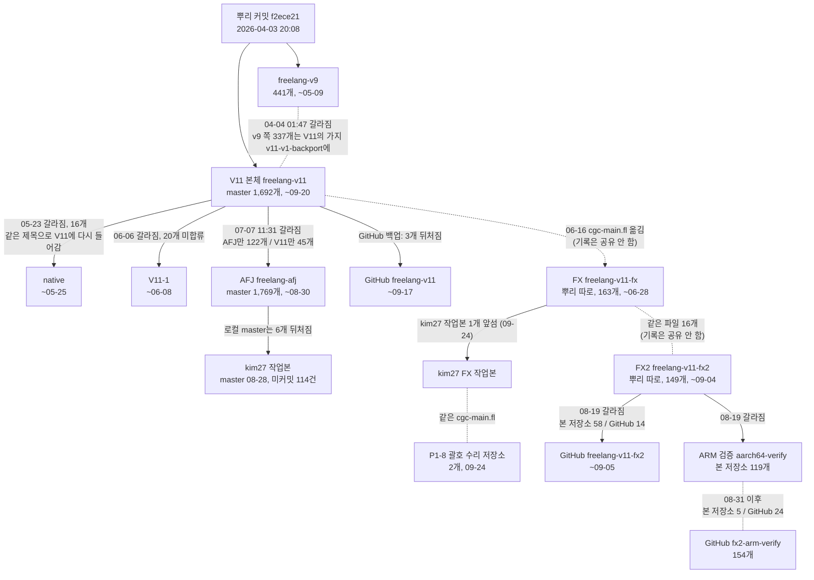

# 지금 쓰는 언어(AFJ Language = FreeLang v11)의 갈래 지도

- 조사일: 2026-09-25. 시각은 모두 한국 시간(KST)입니다.
- 이 문서는 **한 언어(AFJ Language, 이전 이름 FreeLang v11)의 작업이 여러 저장소·가지로 나뉜 모습**을 그립니다. 한 언어 안의 갈래라서, 여기서는 "어디서 갈라졌다", "다시 합쳐졌다" 같은 관계를 적습니다. (번호가 붙은 다른 FreeLang 언어들은 이 코너의 다른 문서처럼 계속 **따로인 언어**로 다룹니다.)
- 근거:
  - 본 저장소 fg.dclub.kr는 API로 가지 목록, 커밋 목록(부모 커밋 포함), 파일 목록(파일 내용의 지문 포함)만 읽었습니다.
  - GitHub 백업은 `gh api`로 같은 정보를 읽었습니다.
  - kim27 작업본은 읽기 전용 git 명령으로만 봤습니다.
  - 저장소를 복제하지 않았고 kim27에 아무것도 쓰지 않았습니다.
- 커밋 수는 저장소마다 같은 커밋이 복사되어 있으므로 **커밋 고유번호(SHA)로 중복을 뺀 수**입니다.

**용어**
- **커밋**: 저장 기록 한 건.
- **가지**: 한 저장소 안에서 따로 쌓아 가는 작업 줄. 영어로 branch.
- **뿌리 커밋**: 기록의 맨 처음 커밋. 뿌리가 같으면 같은 기록에서 나온 것입니다.
- **갈라진 지점**: 두 줄이 마지막으로 공유한 커밋.
- **합류**: 한 줄의 커밋이 다른 줄에 합쳐진 것.
- **수렴**: 여러 곳이 같은 기록이나 같은 파일을 갖게 된 상태.
- **파일 지문**: 파일 내용으로 만든 고유번호. 같으면 내용이 한 글자도 다르지 않습니다.
- **cgc**: FreeLang 코드를 C 코드로 바꾸는 컴파일러. 원본은 FreeLang으로 쓴 `cgc-main.fl`이고, 만들어진 실행 파일은 `cgc-bin`입니다.

## 1. 한눈에 보기

| 갈래 | 위치 | 목적·층위 | 커밋 수·기간 (KST) | 규모 | 관계 |
|---|---|---|---|---|---|
| **V11 본체** | 본 저장소 [freelang-v11](https://fg.dclub.kr/kim/freelang-v11) (가지 28개) GitHub 백업 [freelang-v11](https://github.com/kimjindol2025/freelang-v11) | 해석기(TypeScript `src/`), FreeLang으로 쓴 컴파일러(`self/`, `self/cgc-main.fl` 포함), 표준 라이브러리, C 런타임 일부(`runtime/`), 문서 | master **1,692**, 모든 가지 2,214 2026-04-03 20:08 ~ **2026-09-20 22:11** | 파일 7,064개(node_modules 제외 1,769개): `.fl` 664, `.ts` 479, `.js` 267, `.c` 16 | 뿌리 커밋 f2ece21(04-03 20:08)이 freelang-v9와 같음. freelang-v9와는 b6b3f29(04-04 01:47)에서 갈라짐 |
| **AFJ** | 본 저장소 [freelang-afj](https://fg.dclub.kr/kim/freelang-afj) (가지 5개) kim27 `/home/kim/kim/platform/freelang-afj` 같은 저장소의 두 번째 작업 폴더 `platform/freelang-afj-parameter-shadowing` GitHub [freelang-afj](https://github.com/kimjindol2025/freelang-afj)는 **빈 저장소** | V11 본체와 같은 층위(해석기·컴파일러·표준 라이브러리)에 더해: `projects/`(앱 166개 파일), `AGENTS.md`, `LANGUAGE_LOCK.md`(이름 "AFJ Language" 고정), `bin/fl-afj`, 정적 검사기 `fl-lint`, SSH 표준 라이브러리 | master **1,769**, 모든 가지 1,803 2026-04-03 20:08 ~ **2026-08-30 21:43** | 파일 7,238개(node_modules 제외 1,943개). kim27에서 master 기준으로 셈: `.ts` 483개 약 13.8만 줄, `.fl` 681개 약 7만 줄, `.js` 281개 약 10만 줄 | **V11 본체에서 18d542a(07-07 11:31)에 갈라짐**. 그 뒤 AFJ에만 122개, V11에만 45개. 서로 합류한 적 없음(나란히 가는 두 줄) |
| V11-1 | 본 저장소 [freelang-v11-1](https://fg.dclub.kr/kim/freelang-v11-1) GitHub 백업 같은 끝 커밋 | 해석기 번들 분리, 5계층 구조 정리 | 1,629 04-03 20:08 ~ 06-08 03:14 | 파일 7,053개 | V11 본체에서 b76ddf2(06-06 21:26)에 갈라짐. 이 저장소에만 있는 커밋 20개 중 같은 제목의 커밋이 V11 master에 1개뿐 |
| native | 본 저장소 [freelang-native](https://fg.dclub.kr/kim/freelang-native) GitHub는 빈 저장소 | C 백엔드 이식(문자열·컬렉션·암호 함수를 C로 옮김) | 1,479 04-03 20:08 ~ 05-25 11:57 | 파일 6,963개 | V11 본체에서 2488c18(05-23 20:48)에 갈라짐. 이곳에만 있는 커밋 16개는 **같은 제목의 커밋이 모두 V11 master에 있음**(다시 적용된 것으로 보임) |
| (공통 뿌리) freelang-v9 | 본 저장소 [freelang-v9](https://fg.dclub.kr/kim/freelang-v9) (가지 7개) GitHub 백업 같은 끝 커밋 | 기록상 V11·AFJ·V11-1·native의 앞부분을 가진 저장소. 이 코너의 다른 문서에서는 "FreeLang v9"라는 따로인 언어로 다룸 | 441 04-03 20:08 ~ 05-09 12:05 | 이번에 세지 않음 | 04-04 01:47 이후 v9에만 408개. 그중 337개는 V11 저장소의 가지 `v11-v1-backport`에 들어 있음. 71개는 V11 저장소에 없음 |
| **FX** | 본 저장소 [freelang-v11-fx](https://fg.dclub.kr/kim/freelang-v11-fx) GitHub 백업 같은 끝 커밋 kim27 `/home/kim/kim/platform/freelang-v11-fx` | **C 네이티브 런타임 + 컴파일러 원본 `self/cgc-main.fl`** + 앱 모음(fx-chat, fx-sqlite-browser 등). README: "FL v11 fx C 네이티브 런타임 + 앱 생태계" | 163(kim27에만 +1) 06-07 20:19 ~ 06-28 08:58 (kim27 작업본 09-24 09:34) | 파일 162개. kim27에서 셈: `.c` 30개 8,888줄, `.fl` 46개 9,591줄 | **뿌리가 따로임**(f0800a3). V11과 공유하는 커밋 없음. 06-16 02:29에 V11에서 `cgc-main.fl`을 이 저장소로 옮김(V11 e422ecc "cgc-main.fl을 freelang-v11-fx 레포로 이전", FX cc841ba가 8초 차이) |
| **FX2** | 본 저장소 [freelang-v11-fx2](https://fg.dclub.kr/kim/freelang-v11-fx2) GitHub [freelang-v11-fx2](https://github.com/kimjindol2025/freelang-v11-fx2) (**본 저장소와 갈라져 있음**) | "AFJ Runtime": 패키지 시스템을 넣은 C 런타임, 네이티브 실행 파일 빌드. 컴파일러 원본은 맨 위 폴더의 `cgc-main.fl` | 본 저장소 149(06-21 04:11 ~ 09-04 02:08) GitHub 105(~09-05 07:35) | 파일 276개: `.c` 41, `.fl` 48, 문서 35 | **뿌리가 따로임**(34bb6d6). FX와 공유하는 커밋은 없고, 같은 내용의 파일이 16개 |
| FX2 ARM 검증 | 본 저장소 [freelang-v11-fx2-aarch64-verify](https://fg.dclub.kr/kim/freelang-v11-fx2-aarch64-verify) (가지 4개) GitHub [freelang-v11-fx2-arm-verify](https://github.com/kimjindol2025/freelang-v11-fx2-arm-verify) (**이름도 내용도 다름**) | ARM(aarch64) 컴퓨터에서 FX2 빌드 검증 | 본 저장소 119(06-21 ~ 09-05 10:12) GitHub 154(~09-07 19:32) | 본 저장소 master 파일 260개 | 본 저장소 master는 FX2에서 ef3d7aa(08-19 13:43)에 갈라짐. 본 저장소 `main` 가지는 **뿌리가 따로인** 13개 커밋(09-02 22:27~22:30, "import ARM verification workflow and compiler sources"). GitHub `main`은 FX2 기록 위에 쌓은 124개 |
| FX P1-8 괄호 수리 | 본 저장소 [freelang-v11-fx-p1-8-delimiter-repair](https://fg.dclub.kr/kim/freelang-v11-fx-p1-8-delimiter-repair) kim27 `platform/freelang-v11-fx-p1-8-delimiter-repair` GitHub 없음 | `cgc-main.fl`의 괄호 복구 결과와 검증 기록 | 2 09-24 09:13 ~ 09:47 | 파일 2개 | 뿌리가 따로임. 들어 있는 `self/cgc-main.fl`이 kim27 FX 작업본의 09-24 커밋 파일과 **지문이 같음** |
| WL2 성능 측정 증거 | 본 저장소 [freelang-v11-wl2-benchmark-evidence](https://fg.dclub.kr/kim/freelang-v11-wl2-benchmark-evidence) GitHub 없음 | 성능 측정 원자료 보관. README: "런타임 소스 저장소와 분리" | 5 09-22 01:48 ~ 09-23 10:19 | 파일 26개 | 뿌리가 따로임 |
| front | 본 저장소 [freelang-front](https://fg.dclub.kr/kim/freelang-front) (가지 3개) GitHub 백업 같은 끝 커밋 | 화면(프론트엔드) 도구 | 220 05-29 17:21 ~ 08-15 12:49 | 저장소 크기 약 1.5MB | 뿌리가 따로임. V11 본체에 "feat: verify freelang front afj integration"(08-21) 같은 연동 확인 커밋이 있음 |
| 작은 예제 | 본 저장소 [freelang-v11-sqlite-crud](https://fg.dclub.kr/kim/freelang-v11-sqlite-crud), [freelang-mariadb-v11](https://fg.dclub.kr/kim/freelang-mariadb-v11) GitHub는 둘 다 빈 저장소 | DB 예제 | 5(04-17), 3(05-07) | 작음 | 뿌리가 따로임 |

- 커밋 합계(중복 제외):
  - V11 본체·AFJ·V11-1·native와 GitHub V11을 합치면 **2,406개**, freelang-v9까지 넣으면 2,477개입니다.
  - FX 계열은 FX 163개(+kim27 1개)에, FX2·ARM 검증(본 저장소와 GitHub 합) 235개가 따로 있습니다.
- `runtime/cgc-main.c`(C 쪽 시작 파일)는 V11 본체, AFJ, FX, ARM 검증, V11-1, native 모두 **지문이 같고**, FX2만 다릅니다.

## 2. 관계 그림

## 3. 수렴한 곳과 아직 수렴 안 된 곳

### 수렴한 곳 (기록이나 파일이 같음)

| 어디 | 무엇이 같은가 |
|---|---|
| GitHub freelang-v11 ↔ 본 저장소 freelang-v11 | GitHub의 1,689개가 모두 본 저장소에 있음. GitHub에만 있는 커밋 0개 |
| GitHub freelang-v11-1·freelang-v11-fx·freelang-v9·freelang-front ↔ 본 저장소 | 끝 커밋이 같음 |
| native ↔ V11 본체 | native에만 있는 16개(05-24~05-25, C 백엔드 이식)와 같은 제목의 커밋이 V11 master에 모두 있음 |
| V11 본체의 작업 가지 | 28개 중 20개가 master에 합류(dclub-* 10개, v12-alpha, effect-taxonomy, build-pipeline-unify 등) |
| AFJ의 가지 `codex/afj-let-tco-bab695eb` | master에 합류 |
| kim27 AFJ 작업본 ↔ 본 저장소 AFJ | kim27에만 있는 커밋 0개. 두 번째 작업 폴더(`freelang-afj-parameter-shadowing`)의 끝 커밋 = 본 저장소 가지 `fix/parameter-shadowing` |
| V11 본체 ↔ AFJ 파일 | 양쪽에 있는 경로 7,028개 중 **6,974개가 지문까지 같음** |
| `runtime/cgc-main.c` | V11, AFJ, FX, ARM 검증, V11-1, native 모두 같음(FX2만 다름) |
| `cgc-main.fl` 일부 | V11 본체 `self/cgc-main.fl` = ARM 검증 `main` 가지의 `self/cgc-main.fl` FX2 `cgc-main.fl` = ARM 검증 master·main의 `cgc-main.fl` kim27 FX 작업본 = P1-8 괄호 수리 저장소 |

### 아직 수렴 안 된 곳 (양쪽 커밋 수)

| 어디 | 갈라진 지점 | 이쪽에만 | 저쪽에만 | 내용 |
|---|---|---|---|---|
| **AFJ master ↔ V11 master** (본 저장소) | 18d542a, 07-07 11:31 | AFJ **122개** (07-08 ~ 08-30) | V11 **45개** (06-21 ~ 09-20) | 같은 제목의 커밋이 양쪽에 하나도 없음. AFJ에만 있는 파일 210개: `projects/` 166개, `AGENTS.md`, `LANGUAGE_LOCK.md`, `bin/fl-afj`, `fl-lint` 등. V11에만 있는 파일 36개: 표준 라이브러리 core v1, `self/cgc-main.fl` 등. 내용이 다른 파일 54개(`src/` 25개 등) |
| AFJ 백업 | — | AFJ 122개 | — | GitHub freelang-afj는 빈 저장소이고 GitHub freelang-v11에도 없음. **이 122개는 GitHub 백업이 전혀 없음** |
| AFJ의 합류 안 된 가지 | — | `codex/ssh-channel` 21개(08-18~08-25) `fix/parameter-shadowing` 11개(08-30) `codex/jest-open-handles` 2개(08-30) | — | |
| V11의 합류 안 된 가지 | — | `v11-v1-backport` 490개(v9 쪽 기록) `feature/yield3-followup` 12 `feature/local-accounting-dev` 10 `feat/freelang-fix` 5 `feature/effect-enforcement` 2 그 밖에 3개 가지 각 1 | — | 모두 AFJ에도 없음 |
| V11-1 ↔ V11 master | b76ddf2, 06-06 21:26 | V11-1 20개 | V11 83개 | V11-1 마지막 커밋은 "chore: ARCHIVED — v11.10.0으로 머지 완료 (2026-06-08)"라고 적었지만, 기록상 합류는 **확인 안 됨**(같은 제목 1개뿐) |
| freelang-v9 ↔ V11 저장소 | b6b3f29, 04-04 01:47 | v9 408개 | — | 408개 중 337개는 V11의 `v11-v1-backport` 가지에 있고, 71개는 V11 저장소 어디에도 없음 |
| kim27 AFJ 작업본 ↔ 본 저장소 AFJ | — | — | 본 저장소 6개(08-29 ~ 08-30, SSH 관련) | kim27 master는 08-28 23:41에 머묾. 커밋 안 된 변경 114건(`projects/` 45, `reports/` 29, `src/` 22 등) |
| GitHub freelang-v11 ↔ 본 저장소 V11 | 0235180, 09-17 07:55 | — | 본 저장소 3개(09-20) | "Merge fg master into local master"(09-20 08:27)가 있어 V11을 다른 곳에서도 작업한 흔적이 있음. 그 작업본이 어디 있는지는 **확인 안 됨**(kim27 `platform/`에는 V11 작업본 없음) |
| kim27 FX 작업본 ↔ 본 저장소 FX | 022fdf1, 06-28 | kim27 1개(09-24 "fix(cgc-main): restore P1-8 binding-vector delimiters") + 커밋 안 된 변경 7건 | — | 이 커밋은 본 저장소 FX에 올라가지 않았고, 결과 파일만 따로 만든 P1-8 괄호 수리 저장소에 있음 |
| FX2 본 저장소 ↔ GitHub | ef3d7aa, 08-19 13:43 | 본 저장소 58개(~09-04) | GitHub 14개(08-12 ~ 09-05) | GitHub에만: wasm 시험, native async, 예외 규약 등. 본 저장소에만: HTTP 바이너리 처리, 스트리밍 등 |
| ARM 검증 본 저장소 ↔ GitHub | b3ee3a6, 08-31 06:19 | 본 저장소 master 5개 | GitHub main 24개 | 저장소 이름이 다름(aarch64-verify / arm-verify). `main` 가지끼리는 **공통 커밋이 없음**(본 저장소 main 13개, GitHub main 124개). 같은 이름의 가지 `verify/runtime-recovery-h4g`는 GitHub가 34개 더 있음 |
| FX ↔ FX2 | 공통 커밋 없음 | FX 163개 | FX2 149개 | 같은 파일 16개뿐. 컴파일러 원본 위치도 다름(FX `self/cgc-main.fl`, FX2 맨 위 폴더 `cgc-main.fl`) |
| **컴파일러 원본 `cgc-main.fl`** | — | — | — | **서로 다른 판이 6개**: V11 본체 234b64d 본 저장소 FX 1d29322 kim27 FX·괄호 수리 7c74238 FX2·ARM 검증 2c03f3f V11-1 2c81365 native 7c61d18. AFJ에는 이 파일이 없음(06-16 FX로 옮긴 뒤로) |
| 같은 작업이 두 곳에서 | — | FX 3개(06-26 23:38~23:49 "P1-8 nested defn hoisting") | V11 2개(06-27 10:06 "[P1-8] bug4: nested-defn hoisting") | 06-16에 FX로 옮긴 `cgc-main.fl`을 V11이 06-27에 다시 들이면서, 같은 이름의 작업이 양쪽에 따로 기록됨 |

## 4. 수렴하려면 정해야 할 것 (선택지)

1. **언어 본체를 어느 저장소로 할지.**
   - AFJ(`LANGUAGE_LOCK.md`로 이름 "AFJ Language"를 고정)와 V11 본체가 07-07부터 122개 대 45개로 따로 쌓이고 있습니다.
   - 선택지: V11의 45개를 AFJ로 합치기 / AFJ의 122개를 V11로 합치기 / 둘을 합친 새 기준 저장소 만들기.
   - 내용이 다른 파일 54개는 어느 쪽 판을 쓸지 파일마다 정해야 합니다.
2. **컴파일러 원본 `cgc-main.fl`의 정본 위치.** 선택지: FX(`self/`), V11 본체(`self/`), FX2(맨 위 폴더). 서로 다른 판 6개 중 어느 것을 기준으로 삼을지도 함께 정해야 합니다.
3. **C 런타임 줄로 FX와 FX2 중 무엇을 쓸지.** 둘은 뿌리가 달라 기록으로는 합칠 수 없고, 파일 단위로 옮겨야 합니다. FX는 06-28 이후 본 저장소 커밋이 없고, FX2는 09-04까지 쌓였습니다.
4. **ARM 검증 저장소 둘(본 저장소 aarch64-verify, GitHub arm-verify)의 관계.** 이름이 다르고 `main` 가지의 내용이 다르므로, 어느 쪽을 기준으로 할지 정해야 합니다.
5. **합류 안 된 가지 처리.** V11에 8개, AFJ에 3개가 있습니다. 합칠지, 닫을지 정해야 합니다. `v11-v1-backport`(490개)는 v9 쪽 기록을 담고 있습니다.
6. **V11-1과 native의 상태 표시.** V11-1은 스스로 "ARCHIVED"라고 적었지만 기록상 합류하지 않았습니다. native는 내용이 V11에 다시 들어간 것으로 보입니다. 두 곳을 보관 상태로 둘지 정해야 합니다.
7. **GitHub 백업 방식.**
   - AFJ의 122개는 백업이 없습니다.
   - FX2와 ARM 검증은 GitHub 쪽에만 있는 커밋이 있습니다(단순 백업이 아니라 갈라진 상태).
   - V11은 3개 뒤처져 있습니다.
8. **kim27 작업본 정리 여부.**
   - AFJ: 6개 뒤처짐, 커밋 안 된 변경 114건.
   - FX: 올리지 않은 커밋 1개, 커밋 안 된 변경 7건.
   - (이 문서는 조사만 했고 아무것도 바꾸지 않았습니다.)
